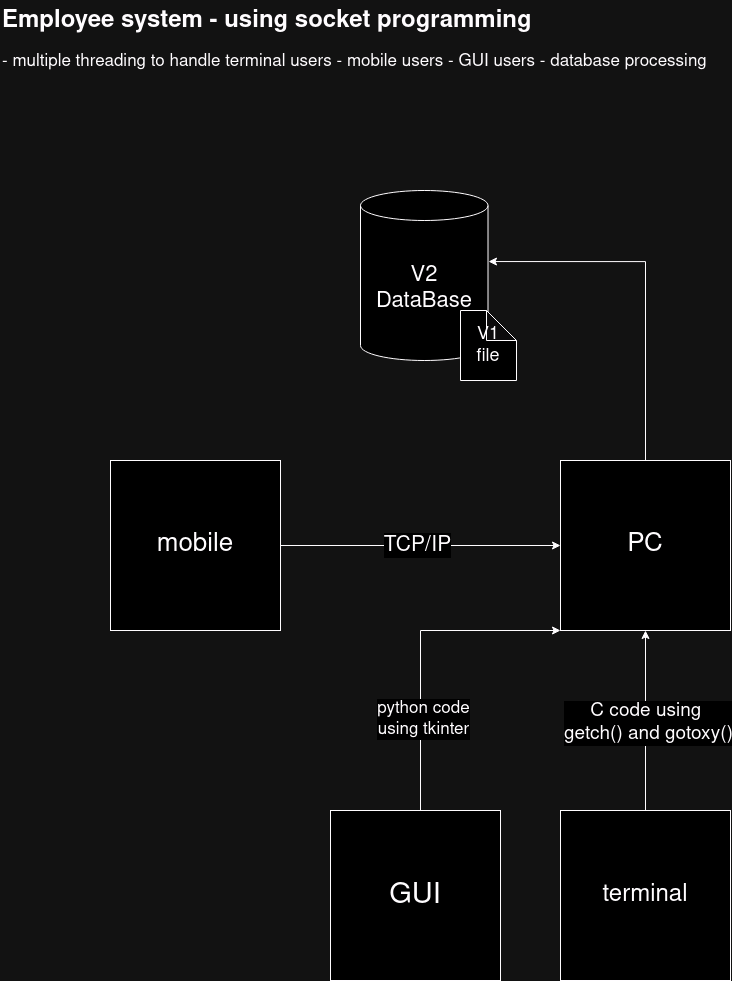

<html>
<body>

<h1>Welcome to My Project</h1>

This project is an example of Empolyee System Using Socket Programming. Below, you'll find instructions on how to clone this repository and start using it.

<h2>Getting Started</h2>

<ol>
    <li>Ensure you have <a href="https://git-scm.com/">Git</a> installed on your system.</li>
    <li>Open your terminal or command prompt.</li>
    <li>Run the following command to clone the repository:</li>
</ol>

<pre>
<code>git clone git@github.com:UsefElbedwehy/Employee-system---Using-Socket-programming.git</code>
</pre>

<h2>Contact</h2>

For any questions or feedback, feel free to reach out at <a href="mailto:elbedwehyy@gmail.com">elbedwehyy@gmail.com</a>.

</body>
</html>